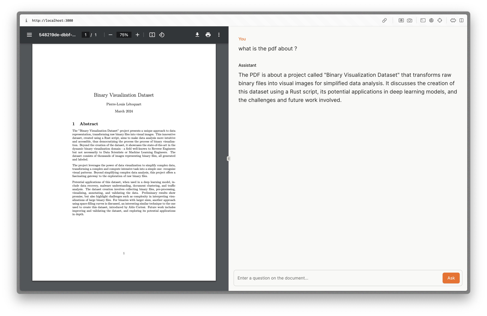

# Chat with your PDFs



This project aims to showcase hox to use the LangChain protocol to chat with your documents.

In that specific case, their is a "preprocessing" step that is done to convert the PDF into a text file. This is done using the `pdf-parse` pkg.

> Keep in mind that this is a very basic example and that the preprocessing step could be done in a more efficient way.
> ONLY BASIC PDFs GIVES GOOD RESULTS

## How to use

1. Clone the repo

```bash
git clone
```

2. Install the dependencies

```bash
bun install
```

3. Run the server

```bash
bun run dev
```

4. Open your browser and go to `http://localhost:3000`

5. Upload a PDF and start chatting with it
